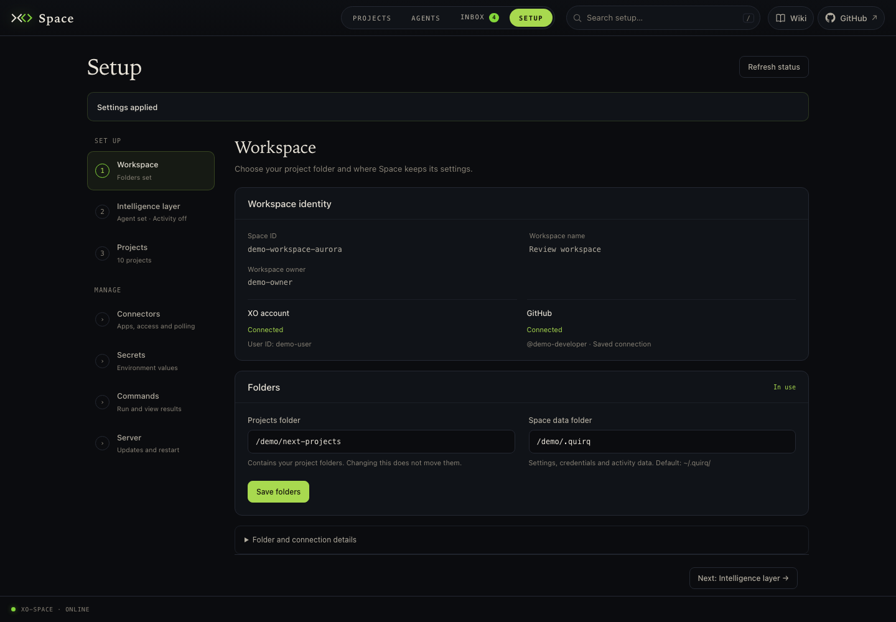

<div align="center">

<a href="https://xo.builders">
  <picture>
    <source media="(prefers-color-scheme: dark)" srcset="brand/xo-logo.svg">
    <source media="(prefers-color-scheme: light)" srcset="brand/xo-logo-light.svg">
    
  </picture>
</a>

# XO Space

**Build, observe and measure agentic work — locally, across every coding agent you use.**

One environment for Claude Code, Codex, OpenClaw, Hermes and Antigravity.<br>
Every project, session, todo and cost on one screen. Measure output, not just tokens.

[Quick start](#quick-start) · [Capabilities](#key-capabilities) · [Supported agents](#supported-agents) · [How it works](#how-it-works) · [Docs](https://docs.xo.builders) · [Contributing](#contributing)

[](https://www.python.org/)
[](https://fastapi.tiangolo.com/)
[](LICENSE)
[](https://github.com/quirq-ai/xo-space/issues)
[](https://github.com/quirq-ai/xo-space/labels/good%20first%20issue)


</div>

---

## The problem

Every coding agent keeps its own session store, its own auth, its own todo list and its own idea of what a "project" is. Use two of them on the same codebase and you have two histories, two usage bills and no single place to look. And none of them tell you what was actually *delivered* — only what was spent.

## What XO Space is

XO Space is the **environment layer** between your machine and your agents: a local server (this repository) that sits in front of the agents you already have installed, plus a browser UI that reads what they do. It does not run models or replace the agents. It stitches them together and measures what they deliver.

```bash
curl -fsSL https://quirq.ai/install | sh      # then open http://localhost:5002/space/
```

---

## Key capabilities

- 👀 **Watch your agents work** — see which agent is active in which project right now, what it touched, and what it's been doing session by session.
- 🗂️ **Your whole workspace in one place** — every folder is a project. Files, git history, todos and live agent activity, browsable from one screen instead of five terminals.
- ✅ **Manage the work, not the chat** — todos per project, kept up to date as agents check them off, so you always know what's done and what's next.
- 🔌 **One API for every agent** — `POST /api/chat/prompt`, read an SSE stream. Same contract whether Claude Code, Codex, OpenClaw, Hermes or Antigravity is behind it; switch with one environment variable.
- 📡 **Sessions across runtimes** — session telemetry from every agent that exposes it, side by side, whichever one you're chatting with.
- 📈 **Know what it cost** — tokens, cost, per-model and per-tool breakdowns in one shape regardless of runtime.
- 🕰️ **See how it grew** — every project's git history in parallel lanes; open any commit as a 3D city map where building height is the churn.
- 🛰️ **Local-first** — binds to `localhost`, needs no account, sends nothing until you sign in. [What leaves your machine](#what-leaves-your-machine).

<table>
  <tr>
    <td width="50%"><br><sub><b>Files</b> — every project in the workspace, which agent is active in it, last activity.</sub></td>
    <td width="50%"><br><sub><b>Timeline</b> — every project's git history in parallel lanes; click a commit for the 3D snapshot.</sub></td>
  </tr>
  <tr>
    <td><br><sub><b>Project drawer</b> — browse a project beside its todos, open sessions and recent events.</sub></td>
    <td><br><sub><b>Setup</b> — storage roots, active agent, credentials, self-update.</sub></td>
  </tr>
</table>

---

## Quick start

### One-click setup

Run this from the directory you want as your workspace — each sub-folder becomes a project:

```bash
curl -fsSL https://quirq.ai/install | sh
```

Then open **http://localhost:5002/space/**.

What the installer does: clones this repo into `./xo-space`, creates a Python 3.12 venv with [uv](https://docs.astral.sh/uv/), and starts the server in the foreground. Ctrl-C stops it; re-running the command updates and restarts it. Machine-local state and logs live in `./.quirq/`, next to your projects — the whole install is one folder you can move or delete. For a clean removal that keeps your project folders, run `./xo-space/uninstall.sh` — see [INSTALLATION.md](INSTALLATION.md#uninstalling).

**Requirements:** `git`. Everything else is optional and only disables its own feature — `node`/`npm` for installing an agent CLI, `gh` for project backup, `rclone` for Drive/OneDrive. Windows runs under WSL ([details](INSTALLATION.md#windows)).

### Manual setup

Same result, step by step — if you'd rather see what you're running, or you're going to hack on it:

```bash
# 1. Clone
git clone https://github.com/quirq-ai/xo-space && cd xo-space

# 2. First run — detects the checkout, uses it in place, writes ./.env with
#    working defaults, and starts the server. Ctrl-C when you've seen it.
./install.sh

# 3. Configure — edit .env to taste (see the table below), then run again
./install.sh
```

`.env` is written once and never rewritten, so your edits survive updates. Values exported in your shell win over the file (`PORT=8080 ./install.sh`). The keys it contains:

| Key | What it does | Default |
|---|---|---|
| `AGENT_NAME` | Which agent handles chat: `claude_code`, `codex`, `openclaw`, `hermes`, `antigravity` | `claude_code` |
| `XO_PROJECTS_ROOT` | Your workspace — the directory whose sub-folders are projects | the directory you ran the installer from |
| `QUIRQ_STATE_ROOT` | Machine-local state: runtime config, saved credentials, watcher cursors, logs. Must not be inside a project | `./.quirq` in that directory |
| `AI_WORKSPACE_ROOT` | The directory the agent subprocess is started in and allowed to touch | same as `XO_PROJECTS_ROOT` |
| `HOST`, `PORT` | Where the server listens. Loopback only by default; set `HOST=0.0.0.0` to reach it from another machine | `127.0.0.1`, `5002` |
| `STAGE` | `local` finds agent CLIs with `which`; `beta` assumes the hosted container layout | `local` |
| `QUIRQ_WATCHER_SOURCE_MODE` | `all` — the watcher reads every installed agent's session store, so Sessions shows all of them; `active` — only `AGENT_NAME`'s | `all` |
| `QUIRQ_SKIP_BOOT_INSTALL` | `1` — install nothing beyond `requirements.txt`. Set `0` to let boot hooks `apt`/`nvm`/`npm -g` the agent CLI for you | `1` |
| `UVICORN_RELOAD` | Auto-restart on code changes — turn on when hacking on the server | `false` |
| `ANTHROPIC_API_KEY`, `CLAUDE_CODE_OAUTH_TOKEN` | Optional. The agent CLI normally uses its own login; set one only if it isn't already authenticated. Leave commented rather than blank | unset |
| `XO_API_KEY` | Links this install to your XO account | unset |

Agent-specific knobs (`CLAUDE_CLI_PATH`, `CODEX_CLI_PATH`, the OpenClaw/Hermes gateway URLs and tokens, Google Drive/Vercel connector settings) are documented in [`.env.example`](.env.example). Roots, the state directory and watcher timing: [INSTALLATION.md](INSTALLATION.md#configuration).

**First run.** The Files tab lists every folder in the directory you installed in. An empty directory shows *No projects in this workspace yet* — `mkdir` or clone a project there, or ask your agent to "create an xo-project". Before the first chat, check Setup: the agent CLI is on PATH (`npm install -g @anthropic-ai/claude-code`) and a credential is saved. Full walkthrough: [INSTALLATION.md](INSTALLATION.md).

### XO Managed Cloud

Don't want to run a server? [app.xo.builders](https://app.xo.builders/) gives you the same XO Space, already running, in an XO-provisioned workspace — one click, nothing to install, your agents and projects ready when you open the tab.

| | Self-hosted | XO Managed Cloud |
|---|:---:|:---:|
| Runs on | your machine | XO-provisioned workspace |
| Setup | one command, you keep it running | none — always on |
| Account & sign-in | optional | built in |
| Updates | re-run the installer | automatic |
| Sharing projects with a team | via GitHub backup | built in |
| Code | this repo | this repo |

---

## Supported agents

Pick the active agent with `AGENT_NAME` (or from the Setup tab). Agents that expose session telemetry show up in the Sessions tab even when they are not the active one.

| Agent | `AGENT_NAME` | Chat | Sessions | Notes |
|---|:---:|:---:|:---:|---|
| **Claude Code** | `claude_code` | ✅ | ✅ | `claude` CLI subprocess |
| **Codex** | `codex` | ✅ | ✅ | `codex exec` subprocess |
| **OpenClaw** | `openclaw` | ✅ | ✅ | HTTP gateway on `:18789`; the default when nothing is configured |
| **Hermes** | `hermes` | ✅ | ✅ | HTTP gateway on `:8642`, one per profile |
| **Antigravity** | `antigravity` | ✅ | ✅ | `agy` CLI subprocess + Google OAuth |
| **Cursor** | — | — | ✅ | Read-only: sessions appear in telemetry, cannot run a turn |
| **Your own** | `<name>` | ✅ | ✅ | Drop `config/agents/<name>/` + `services/cowork_agent/adapters/<name>/` — auto-discovered, no core edits. Guide: [DEVELOPING.md §4](DEVELOPING.md) |

---

## How it works

```
   Space UI (/space/)  ·  XO desktop app  ·  any HTTP/SSE client
                                 │
                                 ▼
                 ┌───────────────────────────────┐
                 │   xo-space server (this repo)  │
                 │   /api/chat  /api/sessions     │
                 │   /api/files /api/usage  …     │
                 │                                │
                 │   adapters/<agent>/  ← one per │
                 │   agent, loaded by AGENT_NAME  │
                 └───────────────┬───────────────┘
                                 ▼
          ~/.claude/  ~/.codex/  ~/.openclaw/  ~/.hermes/  …
                 (each agent's own on-disk state)
```

**A chat turn is two calls:**

```bash
# 1. Send the prompt — returns immediately
curl -sX POST http://localhost:5002/api/chat/prompt \
  -H 'Content-Type: application/json' \
  -d '{"text":"Refactor the auth flow"}'
# → {"stream_id":"8f3a...", "session_id":"9d4e..."}

# 2. Read the response as server-sent events
curl -N http://localhost:5002/api/chat/stream/8f3a...
# event: text-delta   data: {"text":"Sure, "}
# event: done         data: {"finish_reason":"stop", ...}
```

The router never knows which agent it is talking to. Each agent lives in `services/cowork_agent/adapters/<name>/` behind one interface ([`BaseAgentAdapter`](services/cowork_agent/adapters/base.py)), and a background watcher tails each agent's on-disk session files to build the workspace views. Architecture in depth: [DEVELOPING.md](DEVELOPING.md). Full API reference: `/docs` on a running server.

**Projects.** Every direct sub-folder of your workspace root is a project. The watcher writes a `.xo/` folder inside each one with `project.json`, `todos.json`, `stats.json`, a timeline and session *metadata* — ids, counts, timings, cost. Chat content stays in the agent's own store and is never copied there, so a project folder is always safe to push or share.

---

## What leaves your machine

Nothing, by default. A self-hosted install binds to loopback, needs no account, and sends no usage data. Session traces and telemetry stay in `.quirq/` and the agents' own stores.

If you set `XO_API_KEY` (or sign in from the app) to link the install to your XO account, a **daily usage summary** is sent: token counts, estimated cost, and message/session/tool-call counts per model. It never includes prompts, responses, file contents or paths. Leave the key unset to stay signed out.

Everything else on the network happens because you asked for it: `git fetch` when Setup checks for updates, GitHub when you back a project up, connectors you connect, and whatever the agent runtimes themselves do.

---

## Documentation

| Where | What |
|---|---|
| [docs.xo.builders](https://docs.xo.builders) | Product docs: [architecture](https://docs.xo.builders/docs), [installing Space](https://docs.xo.builders/docs/space/install-space), [UI walkthrough](https://docs.xo.builders/docs/space/space-walk), [quirq](https://docs.xo.builders/docs/quirq), the managed cloud |
| [INSTALLATION.md](INSTALLATION.md) | Prerequisites, first run, local data layout, configuration, Windows |
| [DEVELOPING.md](DEVELOPING.md) | Architecture, adding an agent, validation |
| [CONTRIBUTING.md](CONTRIBUTING.md) | Dev setup, ground rules, PR process |
| **In-app Wiki** — `/space/#/wiki` | Operating manual matched to the running build: every tab, the `.xo` data catalog, watcher internals |
| **`/docs`** on a running server | API reference (changes with the active agent) |
| [space_ui/README.md](space_ui/README.md) | The browser UI |
| [plugin/README.md](plugin/README.md) | Claude Code / Codex plugin |
| [AGENTS.md](AGENTS.md) | Rules for AI agents editing this repo |

---

## FAQ

<details>
<summary><b>Does it replace my coding agent?</b></summary>

No. It drives the agents you already have installed and reads what they leave on disk. You still need the agent's own CLI and account.

</details>

<details>
<summary><b>Does it see my conversations?</b></summary>

It reads them from the agent's store to show you sessions, but never copies them into a project folder and never uploads them. See <a href="#what-leaves-your-machine">What leaves your machine</a>.

</details>

<details>
<summary><b>Does it run on Windows?</b></summary>

Under WSL. The watcher uses <code>fcntl</code> and the scripts are bash. See the <a href="INSTALLATION.md#windows">Windows notes</a>.

</details>

<details>
<summary><b>What is quirq?</b></summary>

The output meter — a unit of verified, owner-valued, delivered work, measured by comparing world state before and after instead of trusting self-reports. The <code>.quirq/</code> directory is its local state. <a href="https://docs.xo.builders/docs/quirq">Read more</a>.

</details>

<details>
<summary><b>Do I need an account?</b></summary>

Not to self-host — everything local works signed out. An account is what connects you to <a href="https://app.xo.builders/">XO Managed Cloud</a>, or links a self-hosted install to it.

</details>

---

## Support

Need help? [Open an issue](https://github.com/quirq-ai/xo-space/issues) — bugs, questions and ideas all go there; say if you're not sure it's a bug. The in-app Wiki (`/space/#/wiki`) is the manual for the exact build you're running, and [docs.xo.builders](https://docs.xo.builders) covers the product. For security issues, don't post details — open an issue titled *"Security: request for a private channel"* and a maintainer will reply.

---

## Contributing

We'd love your help. Found a bug 🐛, want a runtime that isn't here 🧩, or have an idea ✨?

- **Start with** [`good first issue`](https://github.com/quirq-ai/xo-space/labels/good%20first%20issue) or [`help wanted`](https://github.com/quirq-ai/xo-space/labels/help%20wanted).
- **Small fix?** Just open the PR. **Bigger change?** Open an issue first so nobody duplicates the work.
- **Adding an agent** is designed to be two folders and zero core edits — the best-paved path in the repo.
- Branch from and target **`development`**; `main` is what the installer ships.

[CONTRIBUTING.md](CONTRIBUTING.md) has the dev setup, the ground rules and the PR checklist. No CLA — contributions are MIT like the rest of the code.

<div align="center">

<a href="https://github.com/quirq-ai/xo-space/graphs/contributors">
  
</a>

</div>

---

## License

Released under the [MIT License](LICENSE).

---

<div align="center">

Part of <a href="https://xo.builders">XO</a> · Maintained at <a href="https://github.com/quirq-ai/xo-space">quirq-ai/xo-space</a> · <a href="https://docs.xo.builders">Docs</a>

</div>
