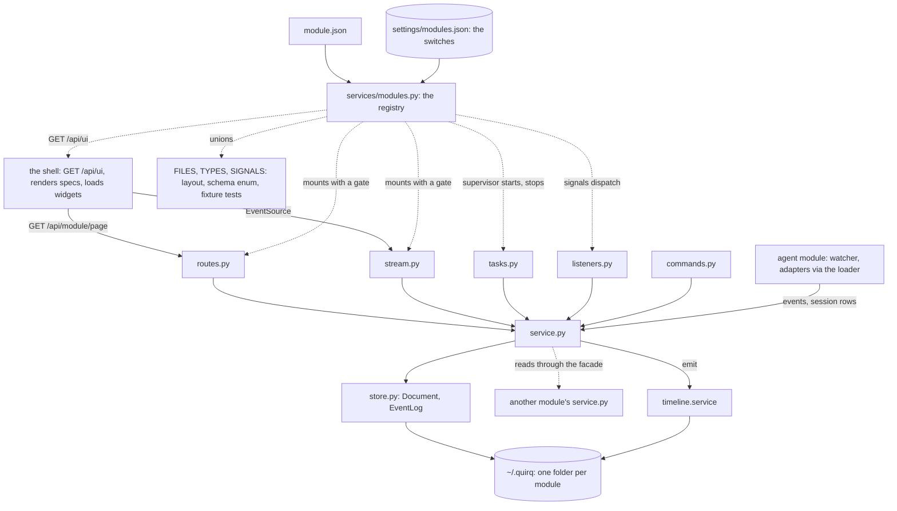
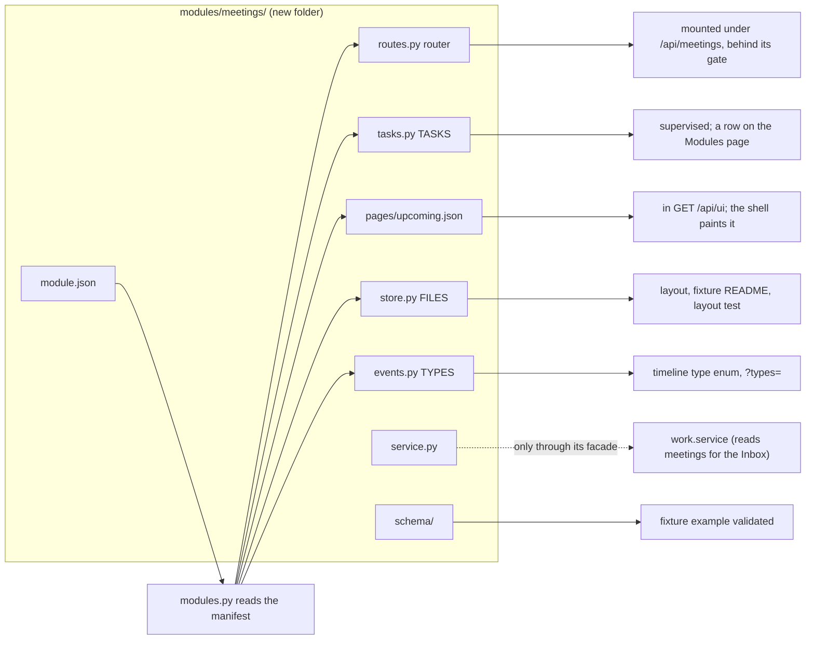
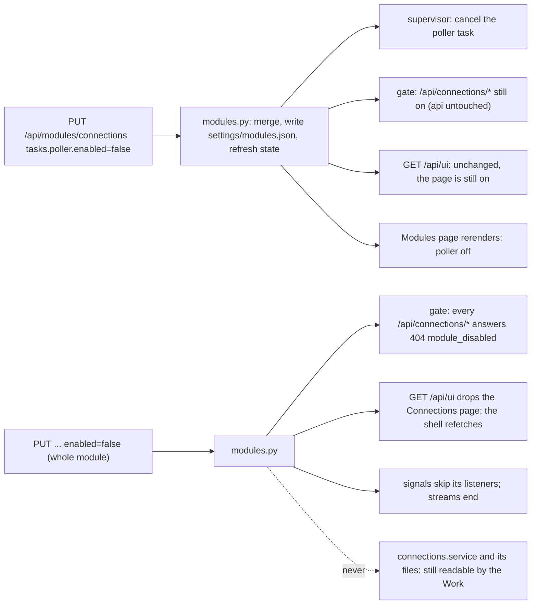
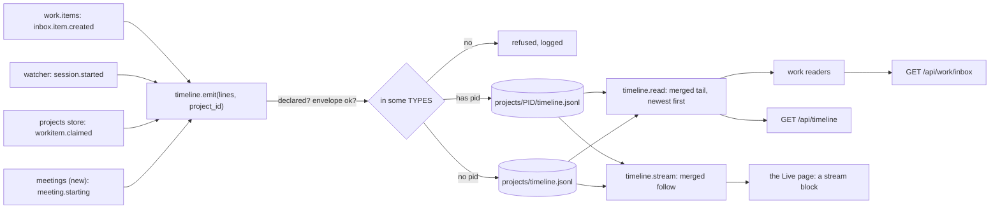
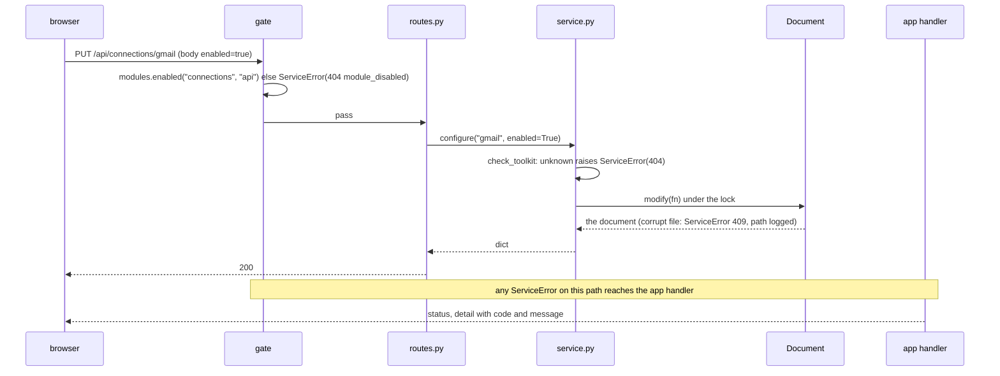
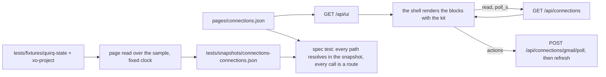

# XO Space architecture: modules, manifests, and a generated UI

Status: proposal, second draft, 2026-09-19. Built on `development` at dc884af.
PR #157 (the Work) lands later and is adapted to this shape at the end of the
migration (section 15). Nothing here is built yet. Section 13 is the tree at
the end, section 14 what adding things looks like afterwards, section 16 the
decisions still open.

Settled with Suraj on 2026-09-19: pages are declarative with a JS escape hatch
for custom widgets; switches are per capability and apply live; the Space
folders become modules and the agent side appears as one module; a folder can
expose api, tasks, pages, streams, listeners and commands.

## 1. What we are after

Three properties, in Suraj's words.

**Extremely modular.** The repo is based on the folder: every folder under
`modules/` can become an api, a stream, a set of pages, background tasks,
listeners or commands, and each of those can be turned on and off on its own
through a simple JSON config, without a restart. Adding, changing or deleting
a module touches that folder and nothing outside it.

**Predictably store and show.** Every file the Space writes is declared once
(where, what role, what schema, how long it is kept). Every page is one read,
described by one spec, and pinned by a test over the one sample state root. A
file on disk without a declaration, a spec that names a field the read does
not answer, a route outside its module's namespace: each fails a test.

**A generated UI.** A module describes its pages in JSON (lists, tables,
cards, forms, stats, streams, actions, polling); the shell renders them with
the existing kit. A module ships JavaScript only for a widget the vocabulary
cannot express (the graph, the timeline plot, the chat, the item thread).

The repo already has the pattern that delivers this: the agent adapters. An
agent is a folder, discovered by a scan, reached through one seam
(`try_load_capability`), guarded by a parity script. The proposal gives the
Space the same treatment, with a manifest per folder, and replaces the
hand-written copies of shared ideas (locks, documents, error mapping, task
start and stop, cache stamps, layout tables, list-and-table pages) with one
primitive each.

## 2. The shape today

| Layer | Size | How it is wired |
|---|---|---|
| Python (`services/`, `routers/`, `utils/`, `server.py`) | 66k lines | 310 route decorators in 54 modules; two hand-kept mount lists (`routers/cowork_agent/__init__.py`, `bff/__init__.py`) plus 13 direct includes in `server.py`; nine background tasks started and cancelled by hand |
| Space UI (`space_ui/js`) | 13k lines | one view registry (good seam); twenty view modules, each with its own fetch, poll, paint and error text; navigation tables kept by hand; a cache stamp on every import; 21 stamped stylesheet links; an import map |
| Tests | 24k lines, 1322 tests | 37 files build their own state-root sandbox; 12 pin cache stamps; docs tests pin README prose |

Where the same idea is written more than once (counts from `development` at dc884af):

| Idea | Copies | Where |
|---|---|---|
| Map a typed service failure onto `{code, message}` HTTP | 7 helpers, 184 `raise HTTPException` sites, 18 `http_error` uses | `bff/errors.http_error`, `project_sharing._http`, `schedules._call`, visualizer `_store_error`, `_todo_write_error`, `_workitem_error`, `_peer_error`, `_github_error` |
| A typed error base | 27 error classes, 2 subclass `ServiceError` | `StoreError`, `RelayError`, `SchedulerError`, 12 `RuntimeError` subclasses, ... |
| Read a JSON document, refuse it when corrupt, write it atomically under a lock | 4 implementations, 51 `locked(` sites in 21 files, 13 corrupt-document sites, 11 raw `json.load` sites, 4 files with their own `fcntl` | connections store, inbox store, scheduler (own `_write_doc`), workitems, todos, peers, claims, github mirror |
| Rotate an append-only log | 2 (2 MB keep 3; 8 MB keep 5), plus one log that never rotates | connections events, project timelines, the Space timeline |
| Name a file's schema | 21 constants in 6 spellings | `SCHEMA`, `TODOS_SCHEMA`, `STATE_SCHEMA`, `_SCHEMA_REF`, `_SCHEMA_ID`, `SYNC_STATE_SCHEMA` |
| Validate an id or a field | 39 private `_validate_ / _check_ / _coerce_ / _clean_` functions | every store |
| Start and stop a background task | 9 start blocks and 9 cancel blocks by hand | `server.py` lifespan; only 2 loops use `periodic.run_forever` |
| Switch a feature on or off | 6 env flags, each read its own way | `XO_GITHUB_POLL_ENABLED`, `XO_CONNECTIONS_POLL_ENABLED`, `XO_SCHEDULER_ENABLED`, `QUIRQ_WATCHER_ENABLED`, `STARTUP_WARMUP_ENABLED`, `QUIRQ_SKIP_BOOT_INSTALL` |
| Describe a stored record | twice: 15 JSON schemas and 45 pydantic classes | `visualizer/schema/`, `bff/_visualizer_models.py` (704 lines) |
| Add an event type | 3 to 4 edits | `ingest/events.py` or a store, `sinks/timeline.py` `_emit_event`, `timeline.schema.json` (closed `propertyNames` enum, 21 `oneOf` branches), `TimelineEvent` |
| Say where a file lives | 3 places by hand | `layout.py`, the fixture README table, the layout test's path map and schema pairs |
| Paint a list, table or card page with filters, actions and a poll | twenty views | `views/inbox.js`, `connectors.js`, `sessions.js`, `projects.js`, `setup*.js`, ... |
| Bust the browser cache | 40+ stamps, 12 test files | every `?v=` in `index.html` and `app.js`, the import map |
| Build a test sandbox | 37 copies | `tests/test_*.py` |

Placement drift on top of that: the scheduler sits below the services layer
(`utils/commands/scheduler.py`), sharing sits under the agent tree though it
is agent-free, the retired Inbox is still mounted, and `bff/visualizer.py`
(1976 lines) serves five subjects from one file.

## 3. The unit: a module

A module is a folder under `modules/` with a manifest. The manifest says what
the folder exposes and what is on by default; the Python files implement it;
the registry checks that the two agree. File names are fixed so that
discovery needs no registration anywhere.

```
modules/<name>/
  module.json         the manifest (section 4): what this folder exposes, on by default or not
  __init__.py         empty
  store.py            FILES = [...]; the Document and EventLog handles; record validation
  events.py           TYPES = (...); SIGNALS = (...)
  service.py          the only surface routes, tasks, streams, commands and other modules call
  routes.py           router: /api/<name>/...                              capability api
  stream.py           STREAMS = {...}: async generators over the event log   capability stream
  tasks.py            TASKS = [...]: background loops                        capability tasks
  listeners.py        LISTENERS = {"<module>.<signal>": fn}                  capability listeners
  commands.py         COMMANDS = {"<name>": fn}                              capability commands
  pages/<page>.json   page specs the shell renders (section 10)              capability pages
  ui/<widget>.js      custom widgets a page spec names (the escape hatch)
  schema/             <file>.schema.json: the on-disk contracts
```

`services/modules.py` is the registry: `modules()` reads every
`modules/*/module.json`; `capability(name, kind)` imports one contract module
or answers `None` (a missing file is normal when the manifest does not
declare the kind; an import error inside one raises, exactly as
`adapters.loader.try_load_capability`); `routers()`, `tasks()`, `streams()`,
`listeners()`, `commands()`, `pages()`, `files()`, `event_types()` union the
declarations in name order; `state()` and `enabled(name, kind, item=None)`
answer the effective switches (section 4). `server.py` mounts `routers()`
and hands `tasks()` to the supervisor; nothing lists modules by hand.

Rules, each pinned by `tests/test_modules.py`:

- What the manifest declares is what the folder implements: a declared kind
  has its file and export, an undeclared kind has no file. `module.json`
  validates against `services/schema/module.schema.json`.
- A `service.py` never imports FastAPI or `routers.`; only `routes.py` and
  `stream.py` do.
- Module A reaches module B only through `modules.b.service` (and reads
  `modules.b.events.TYPES`). The AST test names the offender.
- Every route path in `routes.py` starts with `/api/<name>`; legacy aliases
  are listed in the manifest (`"aliases": ["/api/inbox"]`) and allowed by
  name. Every stream is `/api/<name>/stream/<stream>`.
- Every type a module emits is in its `TYPES`; every listener names a signal
  some module declares in `SIGNALS`; every `File` has a fixture example and
  a schema; every fixture file matches a `File`.

Two things stay outside the folder on purpose: its tests
(`tests/test_<name>_*.py`, because `unittest discover -s tests` is the gate)
and its fixture slice (`tests/fixtures/quirq-state/<folder>/`, because the
page snapshots run over one assembled sample). The module owns its slice
through `FILES`, and the ownership test runs both ways, so deleting the
folder makes orphaned fixture files fail loudly instead of lingering.

**The agent side as one module.** `modules/agent/` carries a manifest and
thin contract files: `routes.py` re-exports the broker routers (`auth/`,
`status/`, `legacy/`, `routers/cowork_agent/*`), `tasks.py` lists today's
boot loops (skills install, MCP gateway reconcile, usage sync, telemetry
daemons, xo.json seed, warmup), `stream.py` is the chat stream. The
implementation stays in `services/cowork_agent/` and `routers/`; the
capability loader stays the seam for agent-specific code; adapters are the
agent module's plug-ins, not modules. The existing invariants stay: route
parity, no agent name in core, the layout migration test, the record rules.

## 4. The manifest and the switches

### 4.1 `module.json`

```json
{
  "schema": 1,
  "name": "connections",
  "title": "Connections",
  "description": "What your connected accounts collected, polled on a schedule.",
  "folder": "connections",
  "depends": ["timeline"],
  "enabled": true,
  "api": true,
  "stream": true,
  "tasks": {"poller": {"enabled": true, "interval_s": 900}},
  "listeners": false,
  "commands": true,
  "pages": {"connections": {"enabled": true}},
  "aliases": []
}
```

Flat on purpose. A capability key is `true`, `false`, or an object with
`enabled` and that capability's own settings; `tasks` and `pages` are keyed
by item so each can be switched alone. `folder` names the state-root folder
the module owns (absent for a module that only writes into a shared tier).
`depends` is documentation the Modules page shows as a warning when a
dependency is off; it never cascades.

### 4.2 The person's switches

`~/.quirq/settings/modules.json` holds overrides, nothing else:

```json
{"schema": 1, "modules": {
  "sharing": {"enabled": false},
  "connections": {"tasks": {"poller": {"interval_s": 300}}}
}}
```

Effective state = manifest defaults with overrides on top (deep merge,
overrides win). Two kernel routes serve it: `GET /api/modules` (every module,
its manifest, its effective state, what each switch does) and
`PUT /api/modules/{name}` (a partial override; validated against the
manifest, so an unknown task or page is a 400). The Setup tab's Modules page
is a spec over those two routes. The registry keeps the effective state in
memory, rewrites it on every `PUT`, and re-reads the file when its mtime
changes, so a hand edit applies within a request.

One rule makes the switches safe: **a switch gates what a module exposes,
never what it stores or what another module reads.** With the connections
poller off, the events already collected still show in the Inbox, because
the Work reads them through `connections.service`, which no switch gates.

### 4.3 Live, without a restart

| Capability | Off means | How |
|---|---|---|
| `api` | every route of the module answers 404 `{"code": "module_disabled"}` | one dependency the registry attaches when mounting: `include_router(router, dependencies=[gate(name, "api")])`; it reads the in-memory state and raises a `ServiceError` |
| `stream` | the stream routes answer 404; open streams end | the same gate; the generator checks the state before each event |
| `tasks.<item>` | the loop is cancelled; on again: spawned | the supervisor (section 9) holds one `asyncio.Task` per declared task; `PUT` cancels or spawns; `interval_s` is read on every tick |
| `listeners` | the module's handlers are skipped | `signals.notify` checks the state before each call |
| `commands` | `quirq <module> <command>` answers "off in Setup" | the CLI reads the state |
| `pages.<item>` | the page leaves navigation; a deep link shows "off in Setup" | `GET /api/ui` is computed from the state; the shell refetches after a toggle |
| `enabled` | all of the above | |

The six env flags of today become entries in the manifests (`agent.tasks`,
`connections.tasks.poller`, `jobs.tasks.tick`); the env variables keep
working for one release as overrides of last resort, then go.

## 5. Storage: two primitives and one table

### 5.1 `Document` and `EventLog`

`services/storage/document.py` composes what `storage/` already has
(`locked`, `write_json_atomic`, `read_stamped_document`,
`CorruptDocumentError`) into the one shape every store rewrites today:

```python
doc = Document(path, schema=3, empty=lambda: {"items": {}}, normalize=normalize_document)
doc.read()               # (document, ok): absent is empty(); a file that is not JSON is ok=False, never rewritten
doc.modify(fn)           # locked read, normalize, fn(doc) -> changed?, write only when True, stamp schema + updated_at
```

A corrupt file raises `CorruptDocument` (a `ServiceError`, 409, generic
message on the wire, path in the log), a newer `schema` raises
`UnsupportedSchema` (409), unknown keys survive a write. This is the rule the
workitems, todos, peers and connections stores each implement; it moves into
one place and the stores keep only their record logic and validation.

`services/storage/eventlog.py`:

```python
log = EventLog(path, rotate_bytes=8 << 20, keep=5)
log.append(lines)                                   # each line starts ts, type; rotates first
log.tail(limit=200, before=None, types=None)        # newest first, across rotated segments
log.follow(since=None, types=None)                  # async generator for streams (section 8)
```

replaces the two rotation implementations, gives the Space timeline the
rotation it lacks, and is what threads, runs, connection events, timelines
and every stream are.

### 5.2 The file table

Each module's `store.py` declares its files; the registry unions them:

```python
FILES = [
    File("connections/accounts.json",                 role="fact",     schema="connections-accounts"),
    File("connections/<toolkit>/config.json",         role="decision", schema="connections-config"),
    File("connections/<toolkit>/state.json",          role="fact",     schema="connections-state"),
    File("connections/<toolkit>/events.jsonl",        role="record",   log=True, rotate="2 MB, keep 3"),
]
```

`role` is one of `record` (what happened; append-only; nothing rebuilds it),
`fact` (a copy of state that lives elsewhere and can be fetched again),
`decision` (what a person chose), `cache` (derived from other files here;
delete freely), `secret`. `tier` defaults to the state root; `committed`
marks `<project>/.xo/`. From the table:

- the fixture README's "what each folder holds" and "delete it and you lose"
  columns are generated (a test fails when the file is stale);
- the layout test's path map, the schema pairs and the "every folder has an
  example" check are derived, not typed;
- `layout.py` keeps `MOVES` and the folder functions; a new module adds a
  folder by declaring it, and the test still fails until the fixture agrees.

## 6. Events: one envelope, open types, written once

Every event line is `{ts, type}` first, then `pid`, `project_id`,
`session_id`, `runtime` when known, then the type's own keys. `type` must be
declared by a module (`events.TYPES`); the keys after the envelope belong to
that module. `timeline.schema.json` shrinks to the envelope plus a `type`
enum that a test asserts equals the union of every `TYPES`; the route model
(`TimelineEvent`) types the envelope and allows extra keys. Adding an event
type becomes one edit, in the module that emits it.

`modules/timeline/` owns the logs: `emit(lines, project_id=None)` validates
the envelope and the type, then appends. Each line is written once: to
`projects/<pid>/timeline.jsonl` when it has a pid, else to
`projects/timeline.jsonl` (the Space-level events: sharing, connections,
jobs, inbox items). The Space timeline read is a merge of every log's tail,
newest first, bounded by the limit; the timeline stream follows every log
the same way. That removes the second copy the sink writes today and the
un-rotated file it goes to. (Decision 1.)

The watcher's dataclasses (`ingest/events.py`) stay as the agent-side
vocabulary; `sinks/timeline.py` becomes the one translation from them to
lines and calls `timeline.emit`. Stores that write lifecycle events (todos,
workitems, claims, items) call `emit` directly.

## 7. Routes: one error seam, ids checked once, discovery, the gate

Three changes make the seven mapping helpers and the per-handler
`try/except` blocks disappear without touching a single path or body shape:

1. **One handler for `ServiceError`** in `server.py`:

   ```python
   @app.exception_handler(ServiceError)
   async def _service_error(_request, exc):
       return JSONResponse(status_code=exc.status, content={"detail": {"code": exc.code, "message": exc.message}})
   ```

   Same wire shape as `HTTPException(detail={code, message})` today. Every
   typed error re-bases on `ServiceError(code, message, status)`; the store
   decides the status where it raises (it knows not-found from invalid from
   corrupt), and `StoreError`, `RelayError`, `SchedulerError` and the
   `RuntimeError` family go. A message that names a path goes to the log,
   not the wire: `ServiceError(..., log="...")`.

2. **Ids are checked in the service**, which raises the 404. The routers'
   `_toolkit_or_404`, `_item_id_or_404`, `_project_id` and the regexes they
   copy from the store vanish.

3. **Discovery with the gate**: `modules.routers()` yields every module's
   `routes.py` router and the registry mounts each with its `api` gate. The
   two hand-kept lists shrink to the agent module's `routes.py` and end
   there. Ordering constraints inside the agent routers (magicpath before
   vercel) stay explicit in that one file.

A handler then reads as it should:

```python
@router.put("/api/connections/{toolkit}")
def configure_connection(toolkit: str, body: ConfigureBody) -> dict:
    return service.configure(toolkit, **body.given())
```

Request bodies stay pydantic and strict (`ForbidExtra`, strict scalars).
Responses are the dicts the service shapes; their shape is pinned by the
schema files, the page snapshots and the spec tests (section 10), not by a
second pydantic mirror. `_visualizer_models.py` keeps only request bodies.
(Decision 5.)

The kernel keeps four routes of its own: `GET /api/modules`,
`PUT /api/modules/{name}`, `GET /api/ui`, and the static mount with the
process controls (`routers/space.py`). Everything else belongs to a module.

Not proposed: declarative route tables. Once errors, ids and the gate are
handled once, a decorator plus a one-line body is already the minimum, keeps
FastAPI's parameter parsing and OpenAPI intact, and reads plainly.

## 8. Streams, listeners, commands

**Streams.** `stream.py` exposes `STREAMS = {"events": events}` where each
value is an async generator `(since, types) -> lines`. The generic one is
`EventLog.follow` over the module's log; the timeline module's follows every
project log merged; the agent module's chat stream is a custom generator.
The registry mounts each as `GET /api/<name>/stream/<stream>` with
`text/event-stream`: `id` is the line's `ts`, `event` its `type`, `data` the
line as JSON, and `Last-Event-ID` resumes. The shell's `stream` block
subscribes with `EventSource` and prepends lines; the Live page is one
`stream` block over the timeline module.

**Listeners.** `listeners.py` exposes `LISTENERS = {"connections.new_events":
on_new_events}`. `services/signals.py` is the in-process bus: a module
declares the signals it raises in `events.SIGNALS`, raises one with
`signals.notify("connections.new_events", toolkit=...)`, and every enabled
listener runs (awaited, errors logged, never propagated). A listener on a
signal no module declares fails the test. This replaces
`register_new_events_listener` and fires from the periodic tick as well as
from `poll_now`.

**Commands.** `commands.py` exposes `COMMANDS = {"poll": poll}` with the
signature `(args: list[str]) -> int | dict`. A tiny entry point,
`venv/bin/python -m quirq <module> <command> [args]`, resolves the module,
checks the switch, and prints the result. The scheduler gains a job kind
`{"module": "connections", "command": "poll", "args": ["gmail"]}` that runs
in process next to the argv jobs it already runs, so a saved job can call a
module without a shell or a subprocess.

## 9. Tasks: a table and a supervisor

```python
# modules/connections/tasks.py
TASKS = [Task("poller", start_connections_poller, interval_s=lambda: settings("poller")["interval_s"])]
```

`services/supervisor.py` starts every declared and enabled task in the
lifespan, holds one `asyncio.Task` per item, reports one that dies, cancels
or spawns on a switch flip, and cancels and awaits each on shutdown. The
nine hand-written start and cancel blocks become one loop.
`periodic.run_forever` stays the loop body for pollers. The agent-side boot
steps that are not loops (agent setup, shared deps) stay in `server.py`.

## 10. Pages: the generated UI

### 10.1 The shell

`space_ui/` becomes a shell that knows the page vocabulary and no page:

```
space_ui/
  index.html            the chrome; no stamps, no import map
  js/shell.js           loads GET /api/ui, builds tabs and pages, keeps the view registry contract,
                        hotkeys, hash routes, per-view bulkheads (today's app.js + registry.js)
  js/core/render.js     one renderer per block type, over the kit
  js/core/expr.js       paths and pipes
  js/core/actions.js    call, open, link, confirm, refresh
  js/core/stream.js     EventSource for stream blocks
  js/core/widgets.js    loads a module's ui/<widget>.js on demand
  js/core/{api,ui,shadcn,chart,markdown,store,preview,command-palette,...}.js   kept
  css/                  kept; one sheet per block family instead of one per view
```

`GET /api/ui` answers `{tabs, pages}`: the tabs and their order from
`modules/ui.json` (the one file that is not a module), and every enabled page
of every enabled module with its spec inline. The shell renders a page from
its spec; today's `registerView` contract stays underneath, so a spec page
and a widget page are both views, with the same mount, show, hide, refresh
and bulkhead.

### 10.2 A page spec

`modules/connections/pages/connections.json`:

```json
{
  "schema": 1,
  "id": "connections",
  "tab": "inbox",
  "route": "inbox/connections",
  "label": "Connections",
  "read": "/api/connections",
  "poll_s": 30,
  "blocks": [
    {"type": "stats", "items": [
      {"label": "Polling", "value": "connections|where:enabled|count"},
      {"label": "Events", "value": "connections|sum:events_total"}]},
    {"type": "list", "items": "connections", "key": "toolkit", "empty": "Nothing is polled yet.",
     "row": {"title": "display_name",
             "meta": ["account_label", "last_ok_at|rel"],
             "badge": {"value": "enabled", "map": {"true": "polling", "false": "off"}},
             "tone": {"value": "last_error", "map": {"null": "ok", "*": "error"}}},
     "actions": [
       {"label": "Poll now", "call": "POST /api/connections/{toolkit}/poll", "then": "refresh"},
       {"label": "Setup", "open": "setup/connectors?toolkit={toolkit}"}],
     "expand": {"type": "table", "read": "/api/connections/{toolkit}/events?limit=50", "items": "events",
                "columns": [{"label": "When", "value": "ts|rel"}, {"label": "Type", "value": "type"},
                            {"label": "Title", "value": "title", "link": "url"}]}}
  ]
}
```

The vocabulary, first set, taken from what the twenty views do today:

| Block | Renders with | Used by |
|---|---|---|
| `stats` | the hero numbers band | every overview |
| `list` | `item` rows with title, meta, badge, tone, actions, optional expand | Inbox, connections, sessions, sharing |
| `table` | columns, sortable, links | events, runs, issues, files |
| `cards` | a card grid with a title, body lines, actions | connectors, projects |
| `detail` | key and value pairs | a session, a project, a job |
| `form` | typed fields (`text`, `password`, `number`, `select`, `toggle`, `textarea`), submit, `restart_required` from the payload | Setup |
| `toggles` | one switch per row, writes on change | the Modules page, connections polling |
| `timeline`, `calendar`, `chart` | the kit's existing builders | Work, Agents trends |
| `stream` | live lines from a module stream | Live |
| `text` | markdown through `markdown.js` | wiki, help |
| `widget` | a module's `ui/<widget>.js` | graph, timeline plot, chat, item thread, session charts |

Expressions are a path into the page payload with pipes: `rel`, `date`,
`count`, `sum:<field>`, `where:<field>`, `map`, `plural:<word>`, `join:<sep>`.
Actions are `call` (method and path template filled from the row and the
page; `then` is `refresh`, `open:<route>` or `toast`), `open` (a page
route), `link` (http and https only, `noopener`), each with an optional
`confirm`. Filters map to the read's query string. The renderer escapes every
value once on its way into the DOM; a spec cannot carry markup, and `text`
goes through the same markdown rules the wiki uses.

### 10.3 The escape hatch

```json
{"type": "widget", "widget": "graph", "data": "graph", "height": "fill"}
```

loads `modules/projects/ui/graph.js`, served at
`/space/modules/projects/ui/graph.js` by one route that maps only `ui/`
folders. A widget exports `{mount(el, ctx), update(data), destroy()}` and
receives its payload slice, the kit, `apiFetch`, `ctx.switchTo` and the
page's refresh. The atlas graph, the timeline plot, the session charts, the
chat and the Work thread become widgets: they keep their drawing code and
lose their own fetch, poll, navigation and error text.

### 10.4 What is generated, what is checked

Every spec validates against `services/schema/page.schema.json`. Every
`value`, `items` and `data` path in a spec resolves over the page's snapshot
payload, so a spec that names a field the read does not answer fails in CI.
Every `call` and `open` names a mounted route or a declared page.
`tests/test_pages.py` renders every page read over the sample state root
with a fixed clock and compares to `tests/snapshots/<module>-<page>.json`;
`UPDATE_SNAPSHOTS=1` regenerates. The browser harness in
`tests/space_ui_preview/` already serves the real shell over invented data;
it is pointed at `/api/ui` and captures each page.

`scripts/new_module.py <name>` writes the manifest, the contract files a
flag asks for, a page spec with one `list` block, a schema, a fixture slice
and a test file, so a new module starts from a running page.

## 11. Tests and docs

`tests/support.py` replaces the 37 sandboxes: `Sandbox` (copies both
fixtures, patches the roots, resets the registry and module caches),
`client()` (TestClient over the app or one module), `fake_stream()` (the
dispatcher stream the runner tests patch), `flip(module, kind, item, on)`.

`tests/test_modules.py` holds the module invariants (section 3) and one
table-driven switch test: for every module and capability, off makes its
routes 404, its tasks stop, its pages leave `/api/ui`, its listeners skip,
and on restores each.

Docs tests stop pinning prose. The HTTP references under
`.agents/skills/xo-projects/references/` and the route list at the top of
each `routes.py` are generated from the mounted routers by
`scripts/write_route_docs.py`; the fixture README's tables come from `FILES`;
a test asserts the generated text is current. README and DEVELOPING sections
describe shapes, not lists.

## 12. Placement: where each module comes from

| Today | Module | What changes |
|---|---|---|
| `services/connections/` + `bff/connections.py` + the Inbox's Connections page and the Connectors polling drawer | `connections` | the first conversion: manifest, routes in, poller as a task, `new_events` as a signal, one page spec |
| `utils/commands/scheduler.py` + `routers/schedules.py` + `views/inbox.js` Jobs page + `core/jobs.js` | `jobs` | `Document` + `EventLog`; the executor stays in `utils/commands/`; the Jobs page as a spec; the module-command job kind |
| `services/cowork_agent/project_sharing/` + `bff/project_sharing.py` + `views/sharing*.js` | `sharing` | agent-free, so a Space module; `status._state` and `recent` become `sharing/state.json` and `sharing/events.jsonl` |
| `sinks/timeline.py` + `workspace/timeline.py` + the timeline routes + the Activity views | `timeline` | section 6; the Live page as a `stream` block |
| `visualizer/{todos,workitems,peers}_store.py`, `workitem_claims.py`, `github_mirror.py`, `scopes.py`, `space_index.py`, `categorized_graph.py`, the records half of `bff/visualizer.py`, `bff/xo_projects.py`, `xo_data.py`, `views/{atlas,projects,tree,project-*}.js` | `projects` | `.xo/` records (committed tier) and the per-project runtime folder; `scopes` becomes the service; list and tree as specs; the graph and the timeline plot as widgets |
| `engine/sessions_io.py`, `routers/{sessions,chat}.py`, the sessions half of `views/sessions.js` | `sessions` | the index, a `purpose` per session, lifecycle events; see decision 2 |
| usage routes, `sinks/stats.py`, `workspace/stats.py`, `telemetry_sources.py`, the usage half of the visualizer routers, the watcher loop's sinks | `telemetry` | the Agents pages as specs with chart widgets; the watcher stays agent-side and writes through this module's store |
| `runtime_config.py`, `xo_cowork_state.py`, `setup_status.py`, onboarding, the secrets routers, `views/setup*.js` | `settings` | Setup as `form` and `toggles` specs; owns the Modules page |
| `services/cowork_agent/connectors/` + `routers/cowork_agent/connectors/` + `views/connectors.js` | `connectors` | a move DEVELOPING.md already lists; cards as a spec, OAuth flows unchanged |
| `services/inbox/` + `bff/inbox.py` + `views/inbox.js` | deleted | `POST /api/inbox` becomes an alias in the work manifest |
| `services/work/` (PR #157) | `work` | adapted last: manifest, routes in, Inbox and History as specs, the thread as a widget, the runner as a task |
| adapters, loader, engine, watcher and ingest, skill installer, registry, `routers/auth`, `routers/status`, `routers/cowork_agent/*` | `agent` | one manifest and thin contract files; nothing moves |

`CLAUDE.md`, `AGENTS.md` and DEVELOPING.md sections 2 and 7 change in the PR
that creates `modules/`: "endpoint handlers in `routers/`" becomes "a
module's routes in its folder; `routers/` holds the agent side".

## 13. The final tree

### 13.1 The repository after step 12

```
xo-space/
├── server.py                      env and roots, middleware, the ServiceError handler, modules.routers()
│                                  mounted with their gates, the supervisor started and stopped, the
│                                  agent-side boot steps, Plane A
├── modules/                       THE SPACE: one folder per module, discovered by module.json
│   ├── ui.json                    the tabs and their order (the one file here that is not a module)
│   ├── connections/  jobs/  sharing/  timeline/  projects/  sessions/  telemetry/  settings/
│   ├── connectors/  work/         each the contract of section 3 (13.2 shows one in full)
│   └── agent/                     module.json + routes.py (re-exports the broker routers) + tasks.py
│                                  (the boot loops) + stream.py (chat): the agent side as one module
├── services/                      THE KERNEL and the agent side
│   ├── modules.py                 the registry: manifests, capabilities, effective state, the gate
│   ├── supervisor.py              one asyncio.Task per declared task; flips live
│   ├── signals.py                 notify(name, **kw) to every enabled listener
│   ├── errors.py  timestamps.py  periodic.py
│   ├── schema/                    module.schema.json  page.schema.json  modules-settings.schema.json
│   ├── storage/                   layout (folders, MOVES)  document  eventlog  flock  atomic_write  reader  paths
│   ├── swarm_api/                 the one swarm client                                          (unchanged)
│   └── cowork_agent/              THE AGENT SIDE, unchanged in shape
│       ├── adapters/<name>/       adapter usage sessions chat routes visualizer_source ...
│       ├── adapters/loader.py     try_load_capability: the seam
│       ├── engine/  registry/     dispatcher messages chat_state usage_loader; agent_registry ...
│       ├── watcher/               the watcher loop, ingest/, sources/, source_loader, project_index
│       │                          (was visualizer/: record stores, sinks and schema/ moved to modules)
│       └── skill_installer.py  skill_catalog.py  project_layout.py  coder_identity.py  ...
├── routers/                       the agent-side HTTP surface, mounted by modules/agent
│   ├── auth/  status/  legacy/
│   ├── cowork_agent/              chat sessions agents config channels files fts secrets skills usage misc ...
│   ├── browser_guard.py
│   └── space.py                   the static mount (no-cache), the ui/ widget route, process controls
├── quirq/__main__.py              python -m quirq <module> <command>
├── config/                        agents/<name>/  models/<name>/                                   (unchanged)
├── utils/                         commands/ (the executor)  local_port.py  runtime_env.py
├── space_ui/                      THE SHELL (section 10.1): index.html  js/shell.js  js/core/  css/
├── tests/
│   ├── support.py                 Sandbox, client(), fake_stream(), flip()
│   ├── test_modules.py            manifests, contracts, switches, ownership
│   ├── test_pages.py  snapshots/<module>-<page>.json
│   ├── test_<module>_*.py
│   └── fixtures/quirq-state/  fixtures/xo-project/     the sample Space; the README tables generated
├── scripts/                       check_route_parity.py  new_module.py  write_route_docs.py  ...
├── .agents/skills/                bundled skills; references/*-http-api.md generated
└── docs/                          design docs (gitignored; force-added with their PR)
```

### 13.2 One module in full

```
modules/connections/
├── module.json          name, title, folder, depends, and the switches: api, stream, tasks.poller,
│                        commands, pages.connections
├── __init__.py
├── store.py             FILES (5.2); Document handles for config.json, state.json, accounts.json;
│                        EventLog for events.jsonl; record validation
├── events.py            TYPES = ("connection.event",)   SIGNALS = ("new_events",)
├── service.py           list_connections, get_connection, configure, remove, poll_now, refresh_account, events
├── routes.py            router: GET /api/connections, GET|PUT|DELETE /api/connections/{toolkit},
│                        POST .../poll, POST .../account, GET .../events
├── stream.py            STREAMS = {"events": follow_events}       GET /api/connections/stream/events
├── tasks.py             TASKS = [Task("poller", start_connections_poller, interval_s=...)]
├── commands.py          COMMANDS = {"poll": poll, "list": list_}   quirq connections poll gmail
├── collectors.py        free modules: the read-only catalog per toolkit
├── mcp_client.py        one streamable-HTTP JSON-RPC session per poll
├── poller.py            the loop body, on periodic.run_forever
├── pages/
│   └── connections.json the Inbox's Connections page (10.2)
└── schema/              connections-config  connections-state  connections-accounts  connections-event  (.schema.json)

tests/
├── test_connections_store.py  test_connections_poller.py  test_connections_routes.py  test_connections_collectors.py
├── snapshots/connections-connections.json
└── fixtures/quirq-state/connections/     accounts.json, gmail/{config.json, state.json, events.jsonl}
```

No `ui/` folder: the page needs nothing the vocabulary lacks. A module with
a graph or a thread adds `ui/<widget>.js` and names it from a spec.

### 13.3 The state root after step 12

Owner and role per file, as `FILES` declares them. A top-level folder is
either owned by one module (its manifest's `folder`) or a shared tier whose
files are owned by pattern (`projects/`, `cache/`, `settings/`).

```
~/.quirq/                                                          owner        role
├── projects/                          shared tier: one folder per project, keyed by pid
│   ├── <pid>/timeline.jsonl (+ timeline.<stamp>.jsonl)            timeline     record
│   ├── <pid>/sessions/sessionslist.d/<shard>.json                 sessions     record (rows carry purpose)
│   ├── <pid>/sessions/sessions-augment.json                       telemetry    cache
│   ├── <pid>/stats.json                                           telemetry    cache
│   ├── <pid>/github/issues.json                                   projects     fact
│   ├── <pid>/workitems/claims.json                                projects     record
│   ├── timeline.jsonl (+ rotated)                                 timeline     record: Space-level events, written once
│   └── offsets.json, <source>-offsets.json                        telemetry    cursor, beside the history it counts
├── work/                                                          work
│   ├── inbox/inbox.json  live/live.json  history/history.json                  decision
│   └── inbox/<connection>/connection.json  items.json                          decision, cache
│       inbox/<connection>/<item>/item.json  session.json  outcome.json         fact, record, record
│       inbox/<connection>/<item>/thread.jsonl  run.log                         record, log
├── connections/                                                   connections
│   ├── accounts.json                                                           fact
│   └── <toolkit>/config.json  state.json  events.jsonl (+ rotated)             decision, fact, record
├── sharing/                                                       sharing
│   ├── <repo>-<hash>.json  removed/<repo>-<hash>.json                          fact, decision
│   └── state.json  events.jsonl                                   NEW: the relay's status and recent, on disk
├── jobs/                                                          jobs (was scheduler/: one Move)
│   └── jobs.json  state.json  runs/<id>.jsonl                                  decision, fact, record
├── usage/<agent>.json                                             telemetry    fact: how far usage was reported
├── settings/                          shared tier
│   ├── modules.json                                   NEW: the switches (4.2)   kernel      decision
│   └── roots.env  runtime.env  onboarding.json                                 settings    decision
├── secrets/secrets.env  token.json                                settings     secret; uninstall keeps it
├── cache/                             shared tier, delete freely
│   ├── graph.json  dashboard.json  sessions.json  stats.json  sessions/        projects, telemetry   cache
│   └── heartbeat.json  activity/                                               telemetry             cache
├── logs/quirq.log  commands.log  jobs/<id>.log                    storage      delete freely
└── .locks/                                                        storage

gone: inbox/   (its api posts adopted into work/history on first boot; one Move drops the folder)
```

The committed tier is unchanged: `<project>/.xo/project.json`, `todos.json`,
`workitems.json`, `peers.json` owned by `projects`, `agent.json` by the
adapter that attaches the folder.

### 13.4 How the pieces connect



## 14. What adding something looks like later

Every addition is one folder, one file or one line, picked up by discovery,
switchable from Setup, and a test names what was forgotten.

| You add | You touch | Picked up by | Catches a miss |
|---|---|---|---|
| A module | `modules/<m>/` from `scripts/new_module.py`: manifest, the contract files it needs, a page spec, a schema; `tests/fixtures/quirq-state/<m>/`; `tests/test_<m>_*.py`; a snapshot | the registry: routes and streams mounted with gates, tasks supervised, listeners subscribed, pages in `/api/ui`, files in the layout and README, types in the timeline enum, a row on the Modules page | `test_modules` (manifest and files agree, ownership both ways), `test_pages` |
| A page | `pages/<page>.json`; `service.<page>()` and its route if the read is new; `tests/snapshots/<m>-<page>.json` | `/api/ui`, the shell | the spec test (every path resolves, every call is a route), the snapshot |
| A widget | `ui/<widget>.js` exporting mount, update, destroy; `{"type": "widget"}` in a spec | `core/widgets.js` on first show | the spec test names an unknown widget |
| A stream | one entry in `STREAMS` (`EventLog.follow` for the generic case); `"stream": true` in the manifest | mounted at `/api/<m>/stream/<name>` | manifest and file agree |
| A listener | one entry in `LISTENERS` naming `<module>.<signal>`; `"listeners": true` | `signals.notify` | an undeclared signal fails |
| A command | one entry in `COMMANDS`; `"commands": true` | `python -m quirq <m> <cmd>`; the scheduler's module-command jobs | manifest and file agree |
| A switch flip | nothing in code: `PUT /api/modules/<m>` or the Modules page | the gate, the supervisor, signals, `/api/ui` | the table-driven switch test |
| An event type | one name in `events.TYPES`; the `emit` call | the schema enum, `?types=`, the timeline stream, the Work readers | `emit` refuses an undeclared type; the enum test |
| A file | one `File` in `FILES`; `schema/<name>.schema.json`; one fixture example | layout, README, the layout test | fixture and `FILES` both ways; schema validation |
| A background loop | one `Task` in `tasks.py`; one entry under `"tasks"` in the manifest | the supervisor | manifest and file agree; the switch test |
| A session client (a new purpose) | the client calls `sessions.service.start(purpose=...)` | rows carry the purpose; lifecycle events land | the sessions tests |
| An agent | `adapters/<name>/`, `config/agents/<name>/` | the capability loader, through the agent module | route parity |
| A core UI helper | `js/core/<x>.js`; importers import it bare | no stamps to bump | nothing needed |

### 14.1 Adding a module

A module called `meetings` (calendar items becoming work), before and after:

```
modules/
├── connections/
├── jobs/
├── meetings/                 + scripts/new_module.py meetings --api --task --page
│   ├── module.json           +   {"name": "meetings", "folder": "meetings", "api": true,
│   │                              "tasks": {"poller": {"enabled": true, "interval_s": 600}},
│   │                              "pages": {"upcoming": {"enabled": true}}}
│   ├── store.py              +   FILES = [File("meetings/meetings.json", role="fact", schema="meetings")]
│   ├── events.py             +   TYPES = ("meeting.starting", "meeting.missed")
│   ├── service.py            +   upcoming(), page()
│   ├── routes.py             +   GET /api/meetings/upcoming
│   ├── tasks.py              +   TASKS = [Task("poller", start_poller)]
│   ├── pages/upcoming.json   +   one list block over GET /api/meetings/upcoming
│   └── schema/meetings.schema.json  +
tests/fixtures/quirq-state/meetings/meetings.json     + one example
tests/snapshots/meetings-upcoming.json                + generated
tests/test_meetings_service.py                        + stamped out
```



Nothing in `server.py`, `layout.py`, the shell, the timeline schema or
another module changes. Deleting the module is `rm -r modules/meetings`; the
ownership test points at the fixture files and the snapshot left behind.

### 14.2 Flipping a switch



### 14.3 Adding an event type



The new type is one name in the emitting module's `TYPES`. The schema enum,
the `?types=` filter, the stream and the Work's timeline reader see it on
the next read; the route model accepts its keys because it types only the
envelope.

### 14.4 A request through the seams



The handler has no `try`, no id regex, no switch check and no mapper; a new
route on any module is a decorator and one line.

### 14.5 A page, from spec to screen



A page that changes shape changes its spec and its snapshot in the same
commit, so a review sees exactly what the Space will show.

## 15. Migration order

Each step is one PR to `development`, leaves the suite green, and changes no
path, body or response shape unless the line says so. PR #157 is not a
dependency; it is adapted at step 11.

| # | Step | Size | Pinned by |
|---|---|---|---|
| 1 | `ServiceError` handler in `server.py`; re-base the typed errors; delete the seven mappers and the per-handler `try/except`; `ForbidExtra.given()` | M | existing route tests unchanged |
| 2 | `Cache-Control: no-cache` on `/space`; strip every `?v=` and the import map; drop the stamp tests | S | one header test, one "no stamps" test |
| 3 | `tests/support.py`; convert sandboxes as files are touched | S | |
| 4 | **The kernel**: `modules/`, `services/modules.py`, `module.schema.json`, the switches file and its two routes, the gate, `services/supervisor.py`, `services/signals.py`; the `agent` module wrapping today's routers and boot loops; the lifespan rewritten; `connections` moved in as the first Space module (api, tasks, stream, commands, signal) | L | `test_modules.py`, the switch test |
| 5 | `Document` and `EventLog`; `jobs` and `sharing` moved in (sharing's state to disk; the module-command job kind); `store_common` duplicates deleted | M | store tests; a shared corrupt-file test |
| 6 | **The shell**: `GET /api/ui`, `modules/ui.json`, the renderer, expressions, actions, streams, widgets; the first specs (Connections, Jobs, the Modules page under a first `settings` module); legacy views keep registering beside spec pages until each is replaced | L | `page.schema.json`, the spec test, `test_pages.py`, the preview harness |
| 7 | `timeline`: envelope, declared `TYPES`, write once, merged read and follow; `TimelineEvent` envelope-only; the Live page as a `stream` block | M | fixture logs validate; the enum test |
| 8 | `projects`: records out of `visualizer/`, `bff/visualizer.py` split, `scopes` as the service; list and tree as specs; the graph and the timeline plot as widgets | L | the existing BFF tests; snapshots |
| 9 | `sessions` (index, purpose, lifecycle events; chat and the runners as clients) and `telemetry` (the Agents pages; chart widgets) | L | runner and sessions tests |
| 10 | `settings` completed (Setup as forms and toggles) and `connectors` moved | M | snapshots |
| 11 | Adapt PR #157: `modules/work/` with a manifest, routes in, Inbox and History as specs, the thread as a widget, the runner as a task; delete `services/inbox` and the retired views | M | its own tests, moved |
| 12 | `python -m quirq`, `scripts/new_module.py`, generated route docs and README tables; docs tests pin generated text | S | |

Steps 1 to 3 need no decision and can start now. Step 4 is the first one
where a folder switches on and off from Setup.

## 16. Decisions

Recommendation first. Decision 3 of the first draft (routes inside the
package) is settled by the folder direction and dropped from the list.

1. **Event logs.** Write each line once (project log when it has a pid, the
   Space log otherwise) and merge on read; or keep the Space copy of every
   project line under the envelope. Recommended: write once. The copy is
   the one thing that can disagree with the projects, and the merged read
   and follow are bounded by the limit.
2. **Sessions.** The sessions module owns the run (start, drain the stream,
   index the row with its purpose, emit lifecycle events) and clients own
   policy (what to start, caps, retries, outcome parsing); or a thin index
   runners write to; or the module owns the runners outright. Recommended:
   owns the run, not the policy.
3. **Cache stamps** replaced by `no-cache` on the static mount. Recommended:
   yes; the shell rewrite assumes it.
4. **Response models.** Dicts shaped by the service, pinned by schema files,
   snapshots and spec tests; or keep the pydantic mirrors as
   `response_model`. Recommended: dicts.
5. **`modules/` at the top level** (the folder is the unit, next to
   `services/` which becomes the kernel and the agent side); or
   `services/<module>/`. Recommended: `modules/`.
