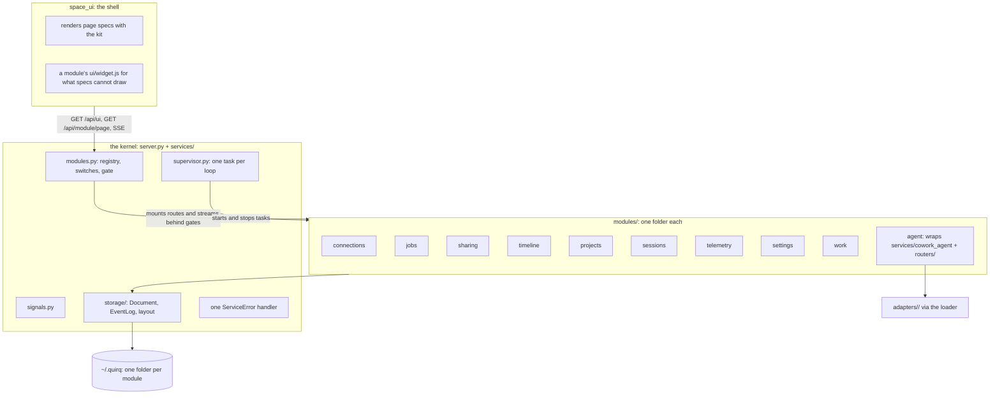
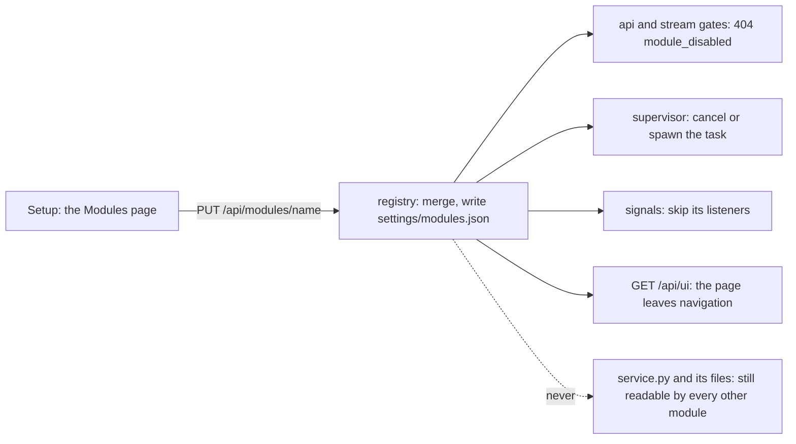
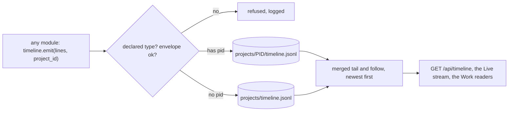
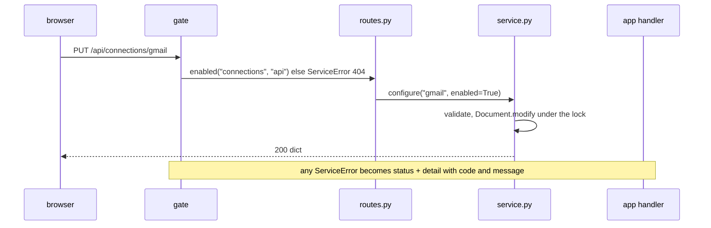
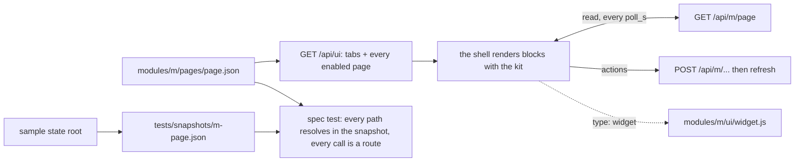
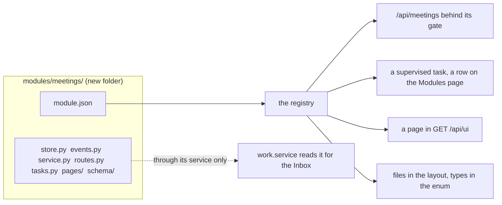
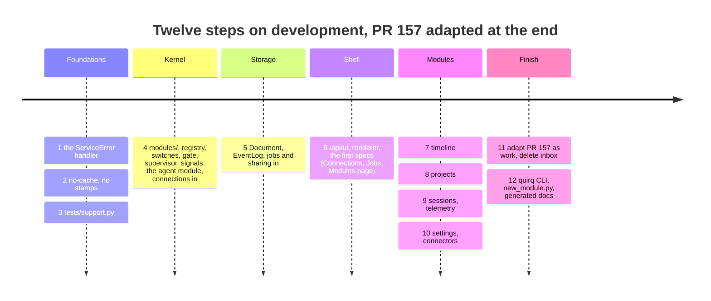

# XO Space architecture

Built on branch `feat/modules-architecture` (2026-09-19, from `development` at dc884af); the Work (PR #157) is adapted to this shape after it lands.
The long form with the survey numbers and the rationale is
`architecture-notes.md`; this is the map.

**The idea in one line:** every folder under `modules/` is a module that
declares what it exposes in a `module.json`, the kernel discovers it, each
capability can be switched on and off live, and the UI is rendered from page
specs the modules ship.

## 1. One picture



| One idea | One place | Replaces today |
|---|---|---|
| A service failure becomes HTTP | `@app.exception_handler(ServiceError)` | 7 mapping helpers, 184 raise sites |
| Read, change and write a JSON file | `storage.Document` | 4 implementations, 51 lock sites |
| An append-only log that rotates | `storage.EventLog` | 2 rotations and 1 log that never rotates |
| A background loop | a `Task` in `tasks.py`, run by the supervisor | 9 start and 9 cancel blocks by hand |
| A feature switch | `module.json` defaults, `settings/modules.json` overrides | 6 env flags, each read its own way |
| A list, table or card page | a page spec in `pages/` | 20 hand-written views |
| Where a file lives and what it is | a `File` in `FILES` | `layout.py`, the fixture README and the layout test, by hand |
| A new event type | one name in `TYPES` | 3 to 4 edits across schema, model and sink |
| Fresh JavaScript in the browser | `Cache-Control: no-cache` on `/space` | 40+ cache stamps, 12 test files |
| A test sandbox | `tests/support.Sandbox` | 37 copies |

## 2. A module is a folder

```
modules/<name>/
├── module.json          what this folder exposes, on by default or not
├── store.py             FILES: every file it writes; Document and EventLog handles
├── events.py            TYPES it emits; SIGNALS it raises
├── service.py           the only surface anything else calls
├── routes.py            router                     api        /api/<name>/...
├── stream.py            STREAMS                    stream     /api/<name>/stream/<s>  (SSE)
├── tasks.py             TASKS                      tasks      background loops
├── listeners.py         LISTENERS                  listeners  react to another module's signal
├── commands.py          COMMANDS                   commands   python -m quirq <name> <cmd>
├── pages/<page>.json    page specs                 pages      rendered by the shell
├── ui/<widget>.js       custom widgets (optional)
└── schema/              <file>.schema.json
```

```json
{
  "schema": 1, "name": "connections", "title": "Connections", "folder": "connections",
  "enabled": true, "api": true, "stream": true, "listeners": false, "commands": true,
  "tasks": {"poller": {"enabled": true, "interval_s": 900}},
  "pages": {"connections": {"enabled": true}}
}
```

The registry (`services/modules.py`) reads every manifest, imports the
declared files, and unions routers, tasks, streams, listeners, commands,
pages, files and event types. A declared kind without its file, or a file
without its declaration, fails `tests/test_modules.py`. Modules reach each
other only through `service.py`. Tests and the fixture slice stay in
`tests/`, owned by `FILES` both ways.

The agent side is one module, `modules/agent/`, whose `routes.py` re-exports
today's broker routers and whose `tasks.py` lists today's boot loops.
Adapters stay its plug-ins; nothing under `services/cowork_agent/` moves.

## 3. Switches, live



| Capability | Off means | How, without a restart |
|---|---|---|
| `api`, `stream` | every route answers 404 `module_disabled` | one dependency the registry attaches at mount |
| `tasks.<item>` | the loop stops; on again, it starts | the supervisor holds one `asyncio.Task` per item |
| `listeners` | its handlers are skipped | `signals.notify` checks before each call |
| `commands` | the CLI answers "off in Setup" | the CLI reads the state |
| `pages.<item>` | gone from navigation; a deep link says why | `/api/ui` is computed from the state |
| `enabled` | all of the above | |

**The one rule:** a switch gates what a module exposes, never what it stores
or what another module reads. The Inbox keeps showing collected mail with
the poller off.

## 4. Storage

```python
doc = Document(path, schema=1, empty=lambda: {"jobs": {}}, normalize=normalize)
doc.read()        # (document, ok): absent is empty(); not JSON is ok=False and never rewritten
doc.modify(fn)    # locked read, normalize, fn(doc) -> changed?, write only then, stamp schema and updated_at

log = EventLog(path, rotate_bytes=8 << 20, keep=5)
log.append(lines); log.tail(limit=200, before=None, types=None); log.follow(since=None)
```

```python
FILES = [
    File("connections/<toolkit>/config.json",   role="decision", schema="connections-config"),
    File("connections/<toolkit>/events.jsonl",  role="record",   log=True, rotate="2 MB, keep 3"),
]
```

| Role | Means | Delete it and you lose |
|---|---|---|
| `record` | what happened; append-only | history nothing rebuilds |
| `fact` | a copy of state that lives elsewhere | nothing; it is fetched again |
| `decision` | what a person chose | their choices |
| `cache` | derived from other files here | nothing |
| `secret` | credentials | access; uninstall keeps `secrets/` |

From `FILES` the fixture README, the layout test and the "delete it and you
lose" column are generated. The state root at the end:

```
~/.quirq/                                              owner       role
├── projects/<pid>/timeline.jsonl                      timeline    record
│            <pid>/sessions/sessionslist.d/            sessions    record (rows carry a purpose)
│            <pid>/stats.json  sessions-augment.json   telemetry   cache
│            <pid>/github/issues.json                  projects    fact
│            <pid>/workitems/claims.json               projects    record
│            timeline.jsonl                            timeline    record: Space-level events
├── work/inbox/  live/  history/                       work        decision, fact, record
├── connections/<toolkit>/                             connections decision, fact, record
├── sharing/  (+ state.json, events.jsonl: new)        sharing     fact, decision, record
├── jobs/  (was scheduler/)                            jobs        decision, fact, record
├── usage/                                             telemetry   fact
├── settings/modules.json (new)  roots.env  runtime.env  kernel, settings   decision
├── secrets/                                           settings    secret
├── cache/  logs/  .locks/                             shared      delete freely
└── (inbox/ gone)
```

## 5. Events: one envelope, written once

Every line is `{ts, type, pid?, project_id?, session_id?, runtime?, ...}`.
`type` must be in some module's `TYPES`; the keys after the envelope belong
to that module. The timeline schema is the envelope plus an enum equal to
the union of every `TYPES`; the route model types the envelope and allows
the rest.



## 6. Routes: one seam, no try/except

```python
@app.exception_handler(ServiceError)
async def _service_error(_request, exc):
    return JSONResponse(status_code=exc.status, content={"detail": {"code": exc.code, "message": exc.message}})

@router.put("/api/connections/{toolkit}")
def configure_connection(toolkit: str, body: ConfigureBody) -> dict:
    return service.configure(toolkit, **body.given())        # unknown toolkit: the service raises the 404
```



Same wire shape as today. Bodies stay strict pydantic; responses are the
dicts the service shapes, pinned by schemas, snapshots and spec tests.

## 7. Pages: the generated UI



```json
{"id": "connections", "tab": "inbox", "route": "inbox/connections", "label": "Connections",
 "read": "/api/connections", "poll_s": 30,
 "blocks": [
   {"type": "stats", "items": [{"label": "Polling", "value": "connections|where:enabled|count"}]},
   {"type": "list", "items": "connections", "key": "toolkit", "empty": "Nothing is polled yet.",
    "row": {"title": "display_name", "meta": ["account_label", "last_ok_at|rel"],
            "badge": {"value": "enabled", "map": {"true": "polling", "false": "off"}}},
    "actions": [{"label": "Poll now", "call": "POST /api/connections/{toolkit}/poll", "then": "refresh"}]}
 ]}
```

| Blocks | `stats` `list` `table` `cards` `detail` `form` `toggles` `timeline` `calendar` `chart` `stream` `text` `widget` |
|---|---|
| Expressions | a path into the payload, with pipes `rel` `date` `count` `sum:` `where:` `map` `plural:` `join:` |
| Actions | `call` (method and path template, then `refresh`, `open:`, `toast`), `open`, `link` (https only), `confirm` |
| Escape hatch | `{"type": "widget", "widget": "graph"}` loads `ui/graph.js` exporting `mount, update, destroy` |

The graph, the timeline plot, the session charts, the chat and the item
thread become widgets: same drawing code, no fetch, poll or navigation of
their own. Everything reaching the DOM is escaped once by the renderer.

## 8. The other capabilities

| Kind | Declare | Get |
|---|---|---|
| stream | `STREAMS = {"events": EventLog.follow(...)}` | `GET /api/<m>/stream/events` as SSE with `Last-Event-ID` resume; the Live page is one `stream` block |
| listener | `LISTENERS = {"connections.new_events": fn}` | called by `signals.notify`; a listener on an undeclared signal fails the test |
| command | `COMMANDS = {"poll": fn}` | `python -m quirq connections poll gmail`; a job kind the scheduler runs in process |
| task | `TASKS = [Task("poller", start, interval_s=...)]` | supervised, switchable, reported when it dies |

## 9. The tree at the end

```
xo-space/
├── server.py                 env, middleware, the ServiceError handler, mount + supervise from the registry
├── modules/                  THE SPACE
│   ├── ui.json               the tabs, in order
│   ├── connections/ jobs/ sharing/ timeline/ projects/ sessions/ telemetry/ settings/ connectors/ work/
│   └── agent/                module.json + thin routes.py, tasks.py, stream.py over the agent side
├── services/                 THE KERNEL and the agent side
│   ├── modules.py  supervisor.py  signals.py  errors.py  timestamps.py  periodic.py
│   ├── schema/               module, page, modules-settings (.schema.json)
│   ├── storage/              layout  document  eventlog  flock  atomic_write  reader  paths
│   ├── swarm_api/
│   └── cowork_agent/         adapters/<name>/  loader  engine/  registry/  watcher/  skill_installer ...
├── routers/                  the agent-side HTTP surface (mounted by modules/agent) + space.py (static, no-cache)
├── quirq/__main__.py         python -m quirq <module> <command>
├── space_ui/                 THE SHELL: index.html  js/shell.js  js/core/{render,expr,actions,stream,widgets,...}.js  css/
├── tests/                    support.py  test_modules.py  test_pages.py  snapshots/  fixtures/  test_<module>_*.py
├── scripts/                  check_route_parity.py  new_module.py  write_route_docs.py
└── config/  utils/  .agents/skills/  docs/
```

## 10. Adding things later

| You add | You touch | Nothing else; a test catches a miss |
|---|---|---|
| A module | `scripts/new_module.py <m>` then the folder; a fixture slice; a snapshot | manifest and files agree; ownership both ways |
| A page | `pages/<page>.json`, the read in `service.py` | spec paths resolve; calls are routes |
| A widget | `ui/<w>.js`, one `widget` block | an unknown widget fails the spec test |
| A stream, listener, command, task | one entry in its file, one key in the manifest | manifest and files agree |
| An event type | one name in `TYPES` | `emit` refuses undeclared types |
| A file | one `File`, a schema, a fixture example | fixture and `FILES` both ways |
| A switch flip | nothing in code | the table-driven switch test |
| An agent | `adapters/<name>/`, `config/agents/<name>/` | route parity |



Deleting the module is `rm -r modules/meetings`; the ownership test names
the fixture files left behind.

## 11. Migration, one PR each



Steps 1 to 3 change no path or shape and need no decision. Step 4 is the
first moment a folder switches on and off from Setup.

## 12. Decisions, recommendation first

1. Event logs: write once and merge on read, or keep the Space copy. **Write once.**
2. Sessions: the module owns the run (start, drain, index with purpose, lifecycle events) and clients own policy, or a thin index, or it owns the runners. **Owns the run.**
3. Cache stamps replaced by `no-cache`. **Yes.**
4. Responses as service-shaped dicts, or keep the pydantic mirrors. **Dicts.**
5. `modules/` at the top level, or `services/<module>/`. **`modules/`.**
